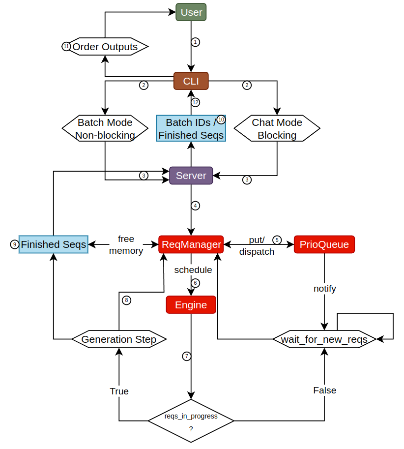

A small LLM serving system for batched inference. Applies a virtual address mapping to the KV cache in order to reduce memory fragmentation and improve throughput.

Detailed report: [pdf](https://github.com/mkuerst/my_project/blob/main/Semester_Project_09_24.pdf)

The key value cache was taken and integrated from: https://github.com/ModelTC/lightllm

Below is an example workflow that processes a batch of requests:

The code was tested using the Llama 8B weights and tokenizer as provided by hugginface: https://huggingface.co/meta-llama/Meta-Llama-3-8B

When running the code, make sure to provide the directories in  [async_llm_engine.py](https://github.com/mkuerst/my_project/blob/main/engine/async_llm_engine.py#L50). Modify the cache_dir and model_dir inputs.
